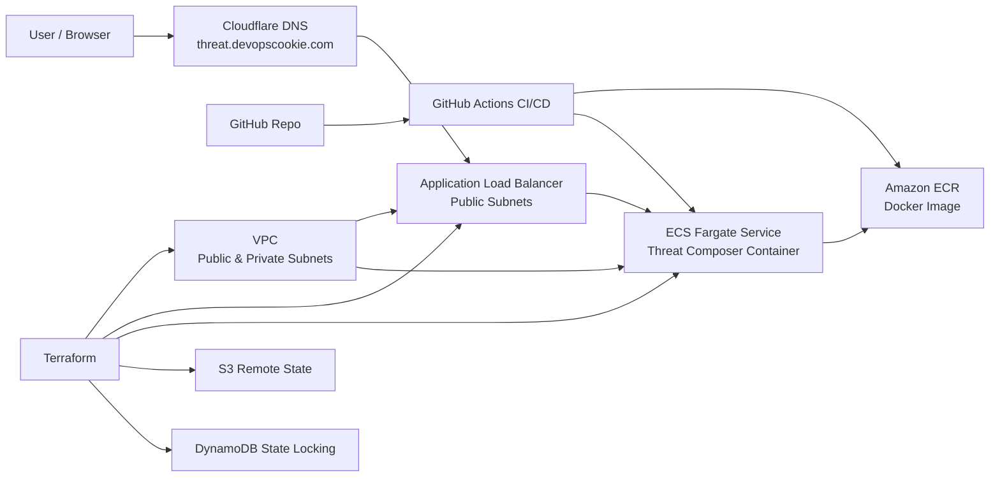
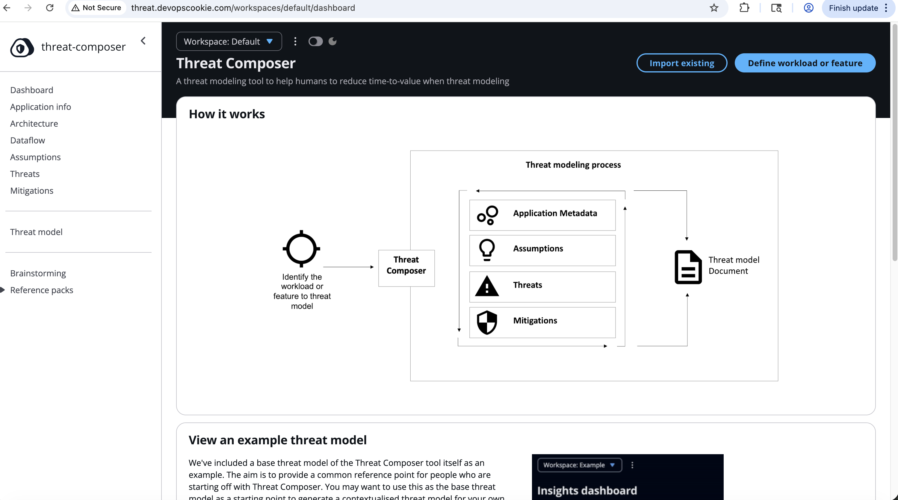
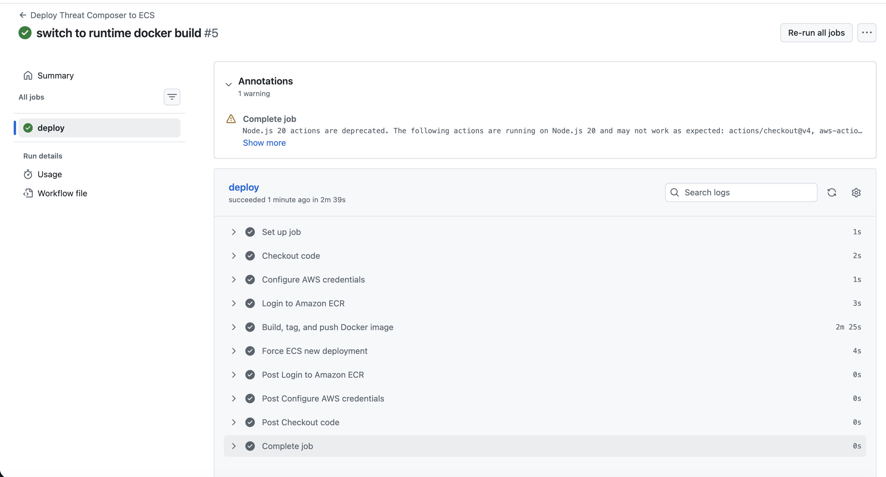

## Production-Grade ECS Deployment – Threat Composer
## Overview

This project demonstrates a production-style deployment of the AWS Threat Composer application on Amazon ECS Fargate, using a fully automated DevOps pipeline.

It follows best practices including:

Infrastructure as Code (Terraform)
Containerisation (Docker)
CI/CD automation (GitHub Actions)
Secure and scalable cloud architecture

The goal of this project is to simulate a real-world DevOps workflow from code commit → deployment.

## Architecture Diagram

## Live Application
http://threat.devopscookie.com

⚠️ HTTPS can be added using ACM + Route53 (optional enhancement)

✨ Features
✅ Deployed on ECS Fargate (serverless containers)
✅ Application Load Balancer (ALB) for traffic routing
✅ Multi-AZ deployment for high availability
✅ Docker multi-stage build for optimized image size
✅ CI/CD pipeline using GitHub Actions
✅ Secure deployment using IAM roles (least privilege)
✅ Custom domain via Cloudflare DNS
✅ Infrastructure fully managed via Terraform modules
✅ Remote Terraform state using S3 backend
📁 Project Structure
ecs-project/
├── .github/
│   └── workflows/
│       └── deploy.yml        # CI/CD pipeline
│
├── app/
│   ├── Dockerfile           # Container definition
│   └── (application code)
│
└── terraform/
    ├── main.tf
    ├── provider.tf
    ├── backend.tf
    ├── variables.tf
    ├── outputs.tf
    └── modules/
        ├── vpc/
        ├── alb/
        └── ecs/
## Infrastructure (Terraform)
Uses modular Terraform structure for scalability
VPC with public subnets across multiple AZs
ALB for routing external traffic
ECS Fargate service for container orchestration
S3 backend for remote state management
🔄 CI/CD Pipeline (GitHub Actions)

Pipeline automatically:

Checks out code
Configures AWS credentials (via GitHub Secrets)
Builds Docker image
Tags image with commit SHA
Pushes image to Amazon ECR
Triggers ECS service deployment
## CI/CD Pipeline

## Docker
Multi-stage build used for optimized image size
Node-based runtime environment
Ensures consistent deployments across environments
💻 Local Development

To run locally:

cd app
yarn install
yarn build
yarn global add serve
serve -s build

Then open:

http://localhost:3000
## Security Best Practices
IAM roles follow least privilege principle
No secrets stored in code (uses GitHub Secrets)
Remote Terraform state (avoids local state risks)
## Future Improvements
Add HTTPS via ACM + Route53
Add NAT Gateway for private subnets
Implement Blue/Green deployment
Add monitoring (CloudWatch / Prometheus)
## Key Learnings
End-to-end DevOps pipeline design
ECS + ALB networking concepts
Terraform modular architecture
Debugging real-world CI/CD failures
Handling monorepo builds in Docker
## Conclusion

This project demonstrates a real-world DevOps deployment workflow using AWS-native services and modern best practices.
